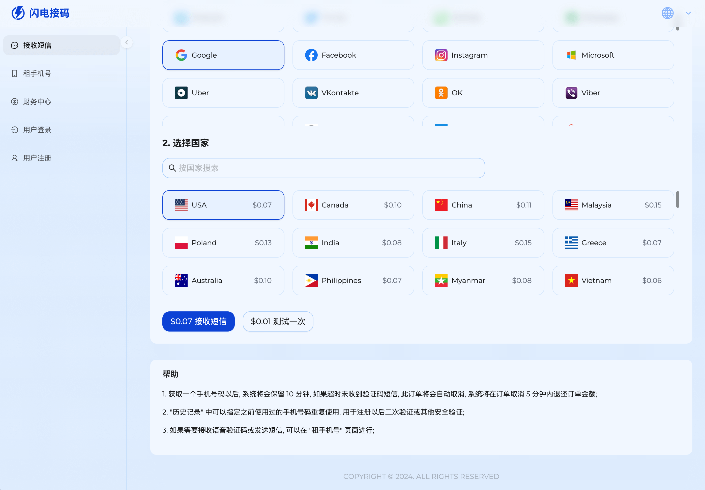
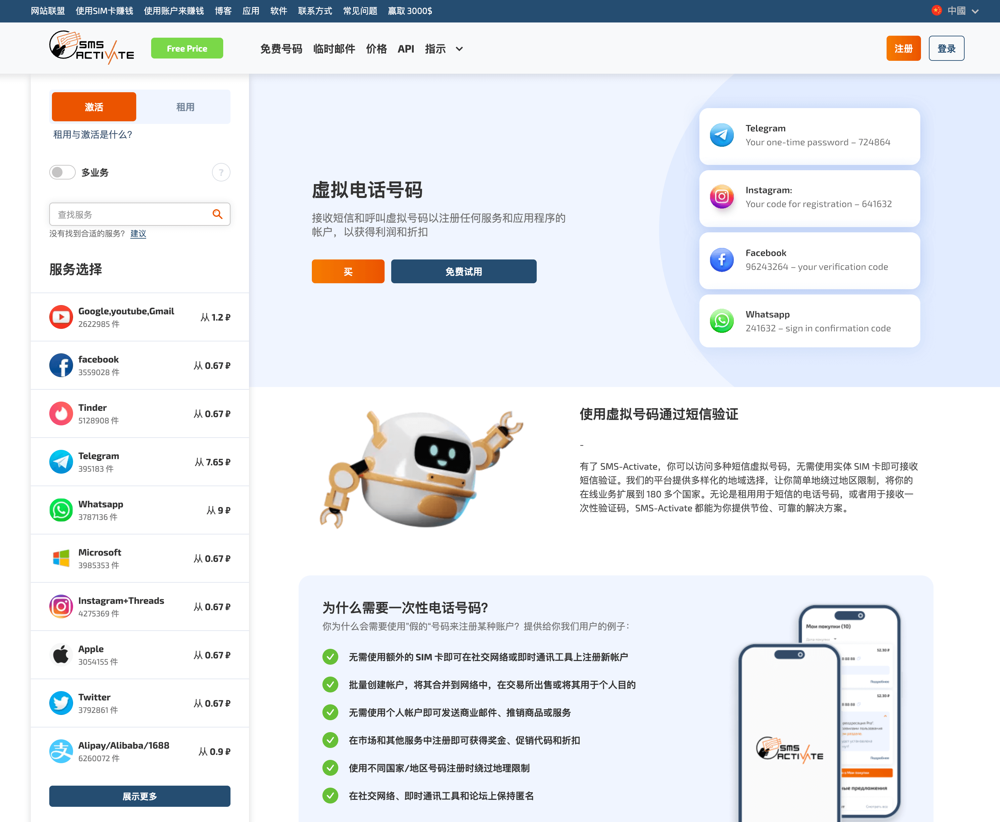
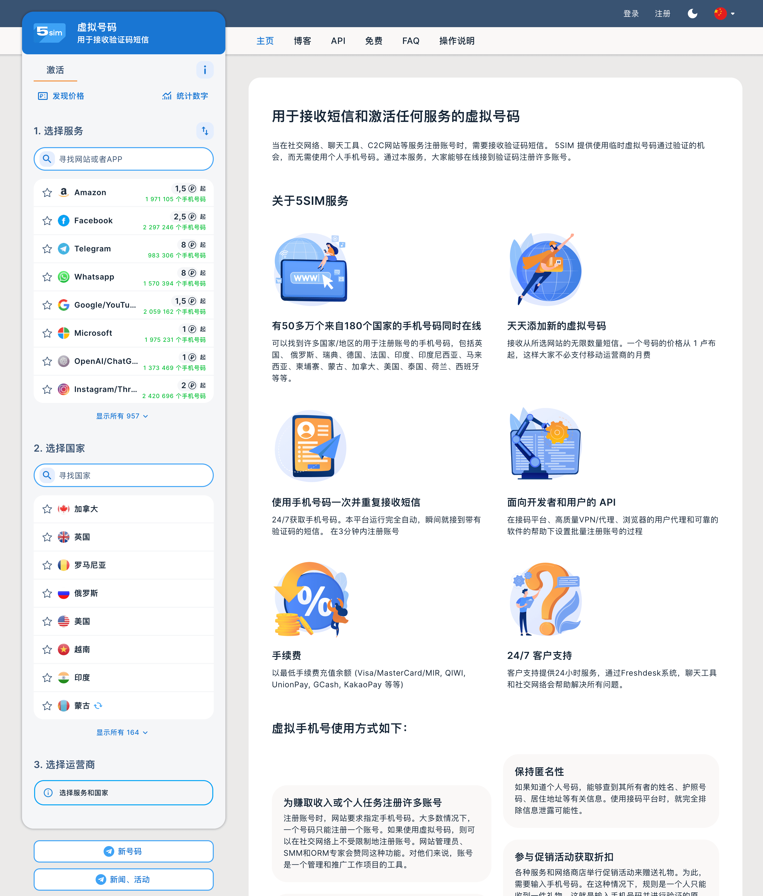

# 接码平台|虚拟号码|隐私号码平台推荐(2024 年 7 月更新)

## Light SMS 闪电接码

网址: [https://lightsms.pro](https://lightsms.pro/?_referrer=adgithubbdakx)

### 特色

- 服务: 1136 个 (Telegram, Twitter, WeChat, Whatsapp, Uber...)
- 国家: 179 个 (中国大陆, 中国香港, 中国台湾, 加拿大, 英国, 俄罗斯...)
- 租号码: 最短 1 小时起租, 最长可以租 12 个月
- 价格: 接短信验证码大部分每次 $0.07~$0.31, 租号码大概每小时 $0.5 到每月 $12

### 优点

- 性价比非常高
- 支持的服务和国家非常丰富 (支持微信和中国大陆)
- 租号码可以选择的时间非常灵活, 价格也比较优惠
- 注册无需实名, 可以使用匿名邮箱
- 可以重复购买之前使用过的号码, 方便二次验证
- 支持加密数字货币充值, 可以做到完全匿名
- 中文支持比较友好

### 缺点

- 试用功能不是完全免费的, 需要充值大概 $0.01
- 网站操作略显复杂, 小白上手没那么方便

## SMS Activate

网址: [https://sms-activate.io](https://sms-activate.io/?ref=1157454)

### 特色

- 服务: 未知个 (Google, Facebook, Telegram, Tinder, Microsoft...)
- 国家: 未知个 (中国香港, 俄罗斯, 哥伦比亚, 印度尼西亚, 英格兰...)
- 租号码: 最短 4 小时起租, 最长可以租 1 个月
- 价格: 接短信验证码大部分每次 $0.11~$0.35, 租号码大概每小时 $1.1 到每月 $9

### 优点

- 老牌网站, 业务成熟稳定
- 业务范围非常广泛, 网站还可以购买成品号和隐私邮箱
- 有专业的推广共赢计划, 适合网站主推广获取收益
- 按月租手机号性价比很高
- 支持加密数字货币充值, 可以做到完全匿名
- 注册无需实名, 可以使用匿名邮箱
- 支持支付宝充值

### 缺点

- 没有中国(大陆)号码
- 网站设计较为过时, 操作起来没那么方便
- 俄罗斯网站, 中文翻译错误较多, 容易误导中文用户
- 没有试用功能

## 5 SIM

网址: [https://5sim.net](https://5sim.net/zh)

### 特色

- 服务: 957 个 (Amazon, Facebook, Telegram, Whatsapp, OpenAI...)
- 国家: 164 个 (泰国, 拉脱维亚, 丹麦, 乌克兰, 俄罗斯...)
- 租号码: 无
- 价格: 接短信验证码大部分每次 $0.31~$0.55

### 优点

- 接收验证码成功率高
- 注册无需实名, 可以使用匿名邮箱
- 可以重复购买之前使用过的号码, 方便二次验证
- 支持加密数字货币充值, 可以做到完全匿名
- 网站操作十分简单, 适合小白新手
- 中文支持比较友好

### 缺点

- 价格偏贵
- 没有中国(大陆)号码
- 只有接短信验证码功能
- 无法接电话验证码
- 无法租号码发短信和打电话
- 没有试用功能
